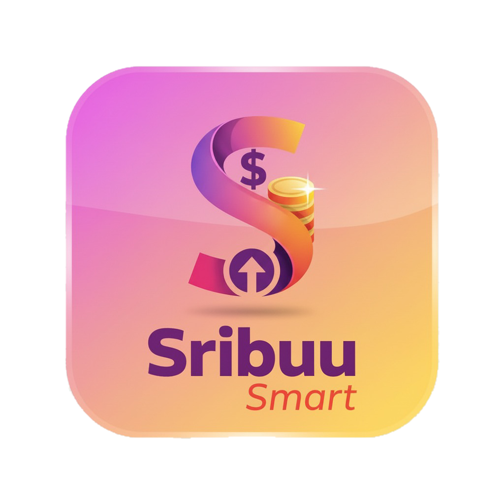
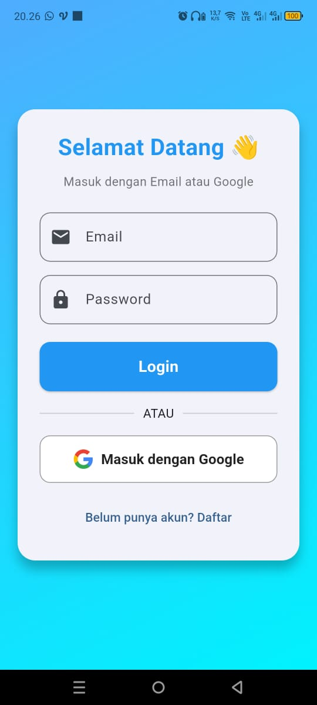
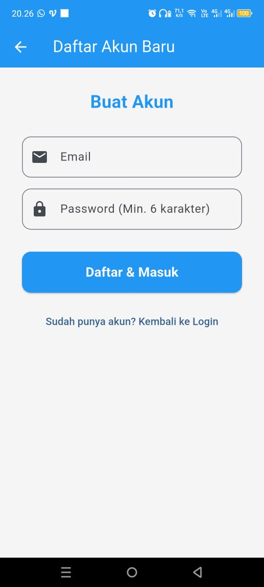
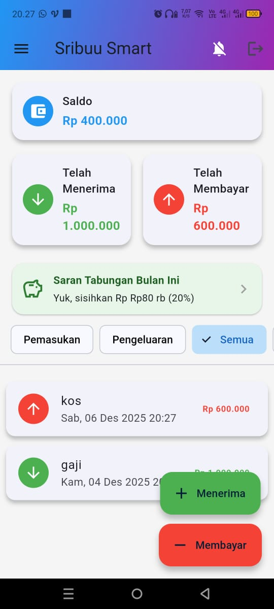
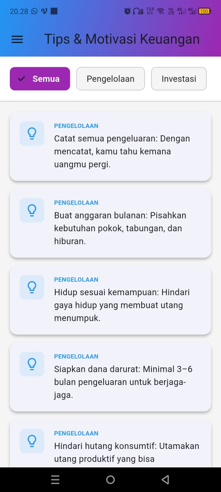
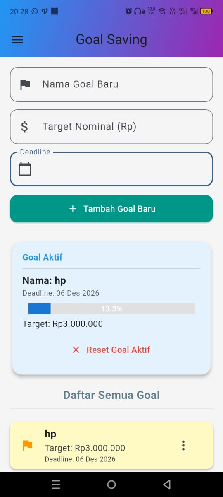
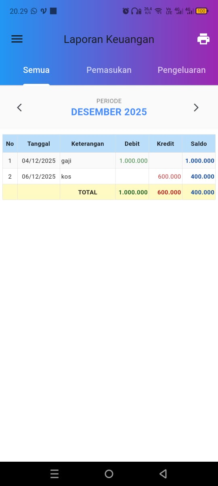

# 💸 Sribuu Smart - Aplikasi Pencatat Keuangan Pintar
**Kelola Keuangan Harian Jadi Lebih Mudah & Cerdas**

> **Project Mobile Programming (Flutter)**
> Program Studi Sistem Informasi, UIN Sultan Thaha Saifuddin Jambi, 2025.

---

## 👤 Pengembang (Developer)

| Nama | NIM |
| :--- | :--- |
| **Daffa Alfareza** | 701230045 |
| **M. Farhan Ramadhan** | 701230049 |
| **Cerry Noviyanti** | 701230042 |

---

## 📝 Deskripsi Aplikasi

**Sribuu Smart** adalah aplikasi mobile berbasis Flutter yang dirancang untuk membantu pengguna mencatat dan memonitor arus kas keuangan pribadi (Pemasukan & Pengeluaran) secara *real-time*.

### 🎯 Masalah & Solusi
* **Masalah:** Pencatatan keuangan manual di kertas seringkali tercecer, sulit menghitung saldo akhir, dan tidak adanya *backup* data jika catatan hilang.
* **Solusi:** Sribuu Smart menyediakan antarmuka modern untuk mencatat transaksi harian. Data tersimpan aman di Cloud (Firebase), sehingga pengguna dapat mengakses riwayat keuangannya kapan saja tanpa takut kehilangan data.

---

## 🛠️ Teknologi yang Digunakan

Aplikasi ini dibangun menggunakan framework **Flutter** dan layanan backend **Firebase**:

* 
* 
* 
* 
* **Database:** Cloud Firestore
* **State Management:** Provider / SetState

---

## 📱 Fitur Utama

1. **Google Sign-In:** Login cepat dan aman menggunakan akun Google.
2. **Dashboard Saldo:** Tampilan saldo total, total pemasukan, dan pengeluaran secara ringkas.
3. **Input Transaksi:** Form input mudah untuk menambah pemasukan atau pengeluaran.
4. **Riwayat Transaksi:** List history transaksi yang tersimpan di Firebase Firestore.
5. **Cloud Sync:** Data otomatis tersinkronisasi dan tidak hilang meski ganti perangkat.

---

## 📸 Tampilan Aplikasi

### Tampilan Login

### Tampilan Register Akun

### Tampilan Beranda

### Tampilan Grafik

### Tampilan Tips Keuangan

### Tampilan Goal Saving

### Tampilan Laporan Keuangan

### Tampilan Leaderboard

---

## 💻 Cara Menjalankan (Instalasi Lokal)

Ikuti langkah berikut untuk menjalankan project ini di emulator atau device fisik:

### 1. Clone Repository## 💻 Cara Menjalankan (Instalasi Lokal)

git clone [https://github.com/Dalfareza13/Sribuu-Smart.git](https://github.com/Dalfareza13/Sribuu-Smart.git)
cd Sribuu-Smart

## Masuk ke folder
Flutter Pub get
Flutter run

